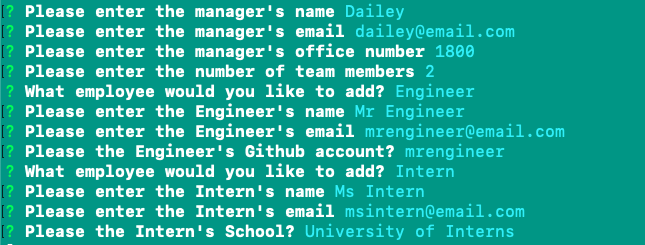

# Employee-Template-Engine

## Description

A CLI application that prompts the user for info on employees based on their roles and aggregates the information on a user-friendly web application.

## Technologies

* JavaScript
* Node.js

## Installation

````
npm install inquirer fs path
````

## Goal of the Project

**Create a command-line application that dynamically generates a software engineering team**

As a command-line appication, I used the npm package "inquirer" to prompt the user for details for the respective employees. Furthermore, I used the "fs" module to write to an .html file synchronously.

## Usage

The following images are example of the web application's appearance and functionality: 




See the end result: [team.html](output/team.html)

## What I Did

#### Prompts with Inquirer Module

````
let employeeAnswers = await inquirer.prompt([
    {
        type: "list",
        message: "What employee would you like to add?",
        choices: ["Engineer", "Intern"],
        name: "newEmployee"
    }
])
````

#### Object-Oriented Programming/Classes

````
class Engineer extends Employee{
    constructor(name, id, email, github){
        super(name, id, email, 'Engineer')
        this.github = github
    }
    getGithub(){return this.github}
    getRole(){return this.role}
}

module.exports = Engineer
````

#### Write to File with File System Module

````
if (!fs.existsSync(OUTPUT_DIR)){
    fs.mkdirSync(OUTPUT_DIR)
}
fs.writeFileSync(outputPath, render(users), "utf-8")
````

## License 

MIT License

Copyright (c) 2020 Dailey Kaze

Permission is hereby granted, free of charge, to any person obtaining a copy of this software and associated documentation files (the "Software"), to deal in the Software without restriction, including without limitation the rights to use, copy, modify, merge, publish, distribute, sublicense, and/or sell copies of the Software, and to permit persons to whom the Software is furnished to do so, subject to the following conditions:

The above copyright notice and this permission notice shall be included in all copies or substantial portions of the Software.

THE SOFTWARE IS PROVIDED "AS IS", WITHOUT WARRANTY OF ANY KIND, EXPRESS OR IMPLIED, INCLUDING BUT NOT LIMITED TO THE WARRANTIES OF MERCHANTABILITY, FITNESS FOR A PARTICULAR PURPOSE AND NONINFRINGEMENT. IN NO EVENT SHALL THE AUTHORS OR COPYRIGHT HOLDERS BE LIABLE FOR ANY CLAIM, DAMAGES OR OTHER LIABILITY, WHETHER IN AN ACTION OF CONTRACT, TORT OR OTHERWISE, ARISING FROM, OUT OF OR IN CONNECTION WITH THE SOFTWARE OR THE USE OR OTHER DEALINGS IN THE SOFTWARE.